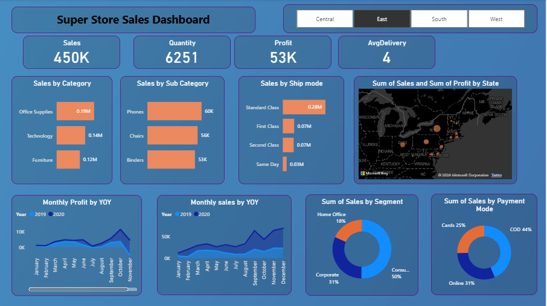
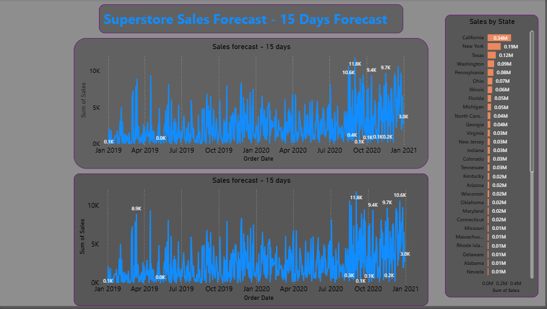

# 📊 Superstore Sales Dashboard (Power BI)

## 🔍 Overview
This project presents an interactive Power BI dashboard built on the Superstore dataset to analyze sales performance, identify key trends, and generate short-term sales forecasts.

The dashboard helps stakeholders make data-driven decisions by providing insights into regional performance, product categories, and future sales trends.

---

## 🛠 Tools & Technologies
- Power BI  
- DAX (Data Analysis Expressions)  
- Data Visualization  
- Time Series Forecasting  

---

## 📈 Key Insights
- The **West region** contributes the highest overall sales.
- **Technology category** generates maximum revenue among all categories.
- Noticeable **seasonal trends**, with peak sales during Q4.
- Forecasting model predicts sales trends for the next **15 days**, helping in planning and inventory management.

---

## 📊 Features
- Interactive filters for Region, Category, and Time
- KPI cards for Sales, Profit, and Orders
- Time-series analysis of sales trends
- Sales forecasting using Power BI analytics

---

## 🖼 Dashboard Preview

### 🔹 Sales Dashboard

### 🔹 Sales Forecast

---

## 📁 Project Files
- `.pbix` file – Main Power BI dashboard
- Screenshots – Dashboard previews

---

## 🚀 How to Use
1. Download the `.pbix` file  
2. Open using Power BI Desktop  
3. Interact with filters and visuals  

---

## 📌 Conclusion
This dashboard demonstrates how data visualization and forecasting techniques can be used to extract actionable insights and support business decision-making.

---

## 🔗 Connect with Me
(www.linkedin.com/in/smitha-h-r-2436a9217)
